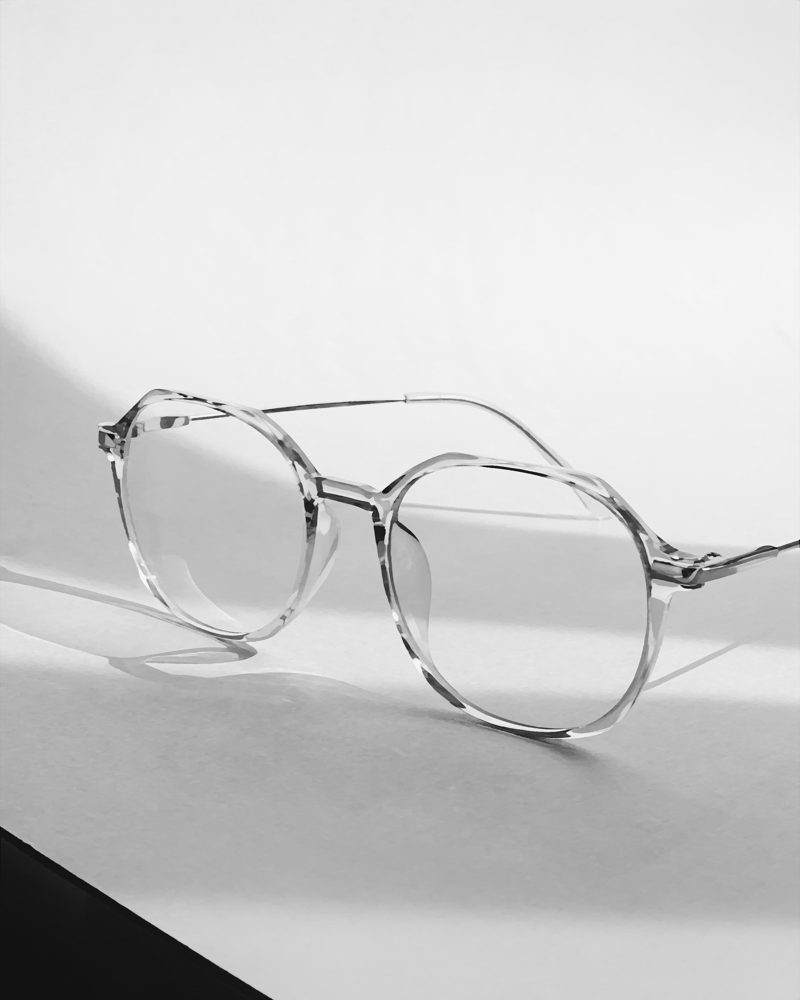

# Bragi - Image processor
Bragi is an image processor build in Odin using Vulkan.

## Using Bragi
Bragi is designed to be used as a command line tool used as shown bellow:
```Shell
/path/to/bragi.exe -i ./images/ -o ./output/ -s ./shaders/
    -i, -I: "Path to images to apply shader to."
    -o, -O: "Path to desired output folder. Bragi will create the folder if it doesn't already exit."
    -s, -S: "Path to compute shaders."
```
The paths used above are the default paths that Bragi will check for if the user doesn't specify a path.

Bragi allows the user to specify either a file or directory for both the -i and -s flags. In the case that a directory is passed the directory will be recursively searched for all files that match the expected file extensions.

In the case that more that one image or shader is passed to Bragi it will apply all the shaders to all the images and output each set of images to its own subdir in the output folder.

Shaders must be compiled to SPIR-V (.spv) before they can be used with Bragi.

## Demo Images

### Original


### Anisotropic Kuwahara Filter

